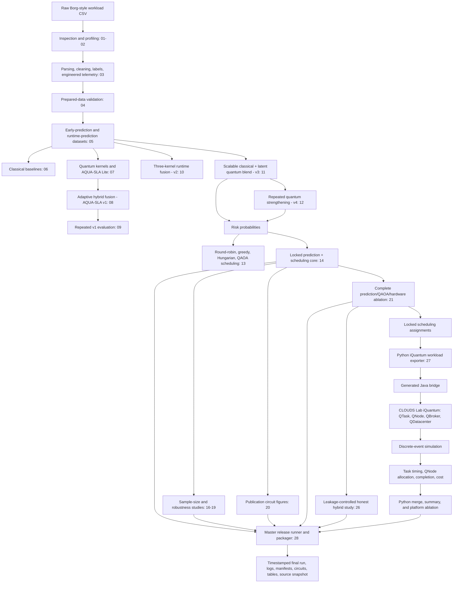

# AQUA-SLA: A Leakage-Aware Hybrid Quantum-Classical Framework for SLA Violation Prediction and Quantum-Cloud Resource Orchestration with Qiskit and iQuantum

> A reproducible research codebase for SLA-violation prediction, hybrid quantum-classical learning, QAOA-based resource scheduling, leakage-controlled ablation, quantum-circuit preservation, and CLOUDS Lab iQuantum discrete-event simulation.

---

## 1. Project objective

AQUA-SLA is an experimental architecture for two connected problems:

1. **SLA-violation prediction:** estimate the probability that a cloud workload will violate an SLA using classical, quantum-kernel, and hybrid predictors.
2. **Risk-aware resource orchestration:** use the predicted SLA risk in resource-assignment policies, including classical schedulers and small-scale QAOA scheduling.

The repository then evaluates the system through:

- repeated-seed prediction experiments;
- sample-size and feature-stability studies;
- prediction-component ablation;
- QAOA depth, shot, and optimizer sensitivity;
- leakage-controlled nested hybrid evaluation;
- optional IBM Quantum and IQM hardware smoke tests;
- CLOUDS Lab **iQuantum** platform simulation;
- final artifact collection and experiment packaging.

### Claim boundary

- **Qiskit** is used for quantum feature maps, quantum kernels, statevector/sampled circuit evaluation, and QAOA experiments.
- **iQuantum** is a Java/CloudSim-based discrete-event modeling and simulation toolkit for quantum-computing environments. It is not physical quantum hardware.
- **IQM** is a separate optional hardware/provider path and must not be confused with iQuantum.
- iQuantum timing/cost outputs and AQUA-SLA analytical scheduler metrics represent different evaluation layers and should not be treated as numerically interchangeable.

---

## 2. System architecture



---

## 3. Why the architecture evolved, and why Script 28 is the final release runner

The script number is a development-stage identifier. It does not mean that every number is a separate publishable model version.

### AQUA-SLA v1: adaptive hybrid kernel (`08_train_aqua_sla_adaptive.py`)

**Purpose:** combine precomputed classical and quantum kernels with a sample-dependent adaptive gate.

**Main limitation:** the first architecture uses a small balanced sample and only four early workload features. It demonstrates adaptive fusion, but it does not yet provide large-scale runtime telemetry, repeated robustness, end-to-end scheduling, or a leakage-controlled final evaluation.

### Repeated v1 evaluation (`09_repeated_aqua_sla_experiments.py`)

**Improvement:** repeats the early hybrid experiment across five seeds and summarizes variability.

**Remaining limitation:** the model remains based on the small early-prediction representation.

### AQUA-SLA v2 (`10_train_aqua_sla_v2.py`)

**Improvement:** moves to legitimate runtime telemetry and introduces three-kernel multiple-kernel learning:

```text
K_v2 = w_c K_c + w_q K_q + w_i (K_c element-wise-multiplied by K_q)
```

Validation data selects kernel weights, SVM regularization, RBF scale, and the decision threshold.

**Remaining limitation:** direct kernel construction is expensive, and the experimental sample remains relatively small.

### AQUA-SLA v3 (`11_train_aqua_sla_v3.py`)

**Improvement:** introduces a more scalable hybrid architecture:

- runtime-feature selection;
- a strong classical HistGradientBoosting branch;
- PCA-based latent compression for the quantum branch;
- a fidelity-statevector quantum kernel;
- validation-only blend and threshold selection;
- explicit exclusion of forbidden leakage columns;
- saved model bundle and test prediction export.

**Remaining limitation:** it is mainly a predictive architecture and uses one principal split. The selected quantum contribution can be small; this must be reported rather than hidden.

### AQUA-SLA v4 strengthening (`12_aqua_sla_v4_quantum_strengthening.py`)

**Improvement:** evaluates multiple seeds, latent quantum dimensions, feature maps, and SVM configurations. It exports repeated results, confidence summaries, paired tests, and risk files for downstream orchestration.

**Remaining limitation:** it strengthens predictive evidence but is not itself a complete resource-management platform.

### Quantum-aware scheduler (`13_aqua_sla_quantum_scheduler.py`)

**Improvement:** converts predicted SLA risk into resource-assignment objectives and compares round-robin, greedy, Hungarian, and QAOA scheduling.

**Remaining limitation:** generic QAOA assignment scales exponentially. The repository therefore includes a smaller `FAST` variant and later uses controlled small-scale QAOA experiments rather than implying large-scale quantum scheduling.

### Locked combined core (`14_aqua_sla_combined_final.py`)

**Improvement:** creates the first end-to-end locked pipeline: prediction evaluation, scheduling assignments, scheduler summaries, improvements, statistical tests, exact-match summaries, metadata, and a paper-ready summary.

**Remaining limitation:** a single final table is insufficient for a defensible paper. Sample-size sensitivity, component ablation, circuit evidence, and leakage-controlled evaluation are still needed.

### Robustness and ablation stages (`16`-`21`)

These scripts add:

- sample-size learning curves;
- repeated-seed feature stability;
- saved models and test predictions;
- publication figures and Excel reports;
- preserved quantum-circuit images and QASM;
- prediction-component ablation;
- QAOA depth/shot/optimizer sensitivity;
- optional IBM/IQM smoke-test hooks.

### Honest hybrid validation (`26_aqua_sla_honest_hybrid_quantum_ablation.py`)

**Improvement:** adds repeated nested stratified cross-validation, inner-fold model/threshold selection, out-of-fold predictions, transparent classical-only/quantum-only/hybrid comparisons, and preservation of the original locked result.

This stage is important because it reduces the risk of optimistic reporting caused by reusing a locked test set for repeated model selection.

### iQuantum platform integration (`27_aqua_sla_iquantum_platform_integration.py`)

**Improvement:** moves beyond analytical scheduling metrics and connects AQUA-SLA assignments to a quantum-cloud discrete-event simulator. It exports an iQuantum workload, generates a Java bridge, invokes Maven, runs iQuantum, imports task results, and writes platform-level summaries and ablation tables.

### Final release runner (`28_aqua_sla_master_experiment_runner.py`)

Script 28 is considered the **final release orchestrator**, not a new prediction algorithm. It finalizes the research workflow because it:

- runs the selected final experiments;
- keeps experiment outputs separated by evaluation layer;
- preserves QASM, QPY, text drawings, circuit images, and metadata;
- records stdout/stderr logs;
- creates execution manifests and checksums;
- snapshots Python and Java source code;
- consolidates tables into an inventory and optional Excel workbook;
- writes each final release to a timestamped, immutable run directory.

Thus, the scientific model culminates in Scripts 14, 21, 26, and 27, while Script 28 makes the full study reproducible and auditable.

---

## 4. Important repository consistency corrections

The uploaded archive contains `21_aqua_sla_complete_quantum_ablation.py`, but the current Script 28 configuration refers to `25_aqua_sla_complete_quantum_ablation.py`. It also refers to circuit scripts `22` and `24`, which are not present in the uploaded archive.

Before tagging the repository as a final release, edit `28_aqua_sla_master_experiment_runner.py` as follows:

```python
EXPERIMENTS = [
    {
        "name": "classical_core",
        "script": "14_aqua_sla_combined_final.py",
        "destination": "01_classical",
        "output_candidates": [
            "results/combined/aqua_sla_final",
        ],
    },
    {
        "name": "sample_size_study",
        "script": "19_aqua_sla_complete_sample_ablation.py",
        "destination": "02_sample_size",
        "output_candidates": [
            "results/prediction/sample_size_study",
        ],
    },
    {
        "name": "quantum_ablation",
        "script": "21_aqua_sla_complete_quantum_ablation.py",
        "destination": "03_quantum_ablation",
        "output_candidates": [
            "results/aqua_sla_final/quantum_ablation_complete",
        ],
    },
    {
        "name": "honest_hybrid_quantum_ablation",
        "script": "26_aqua_sla_honest_hybrid_quantum_ablation.py",
        "destination": "04_honest_hybrid",
        "output_candidates": [
            "results/aqua_sla_final/honest_hybrid_quantum_ablation",
        ],
    },
    {
        "name": "iquantum_platform",
        "script": "27_aqua_sla_iquantum_platform_integration.py",
        "destination": "05_iquantum",
        "output_candidates": [
            "results/aqua_sla_final/iquantum_platform_integration",
        ],
    },
]

CIRCUIT_SCRIPTS = [
    "20_save_quantum_circuit_figures.py",
]
```

These corrections align the final runner with the files and output paths actually present in this repository.

---

## 5. Recommended repository layout

```text
AQUA-SLA-Hybrid-Quantum-Orchestration/
├── Code/
│   ├── 01_inspect_dataset.py
│   ├── ...
│   ├── 27_aqua_sla_iquantum_platform_integration.py
│   └── 28_aqua_sla_master_experiment_runner.py
├── Dataset/
│   ├── borg_traces_data.csv                 # normally not committed
│   └── processed/                           # generated
├── models/                                  # generated; normally ignored
├── results/                                 # generated; selected release results only
├── third_party/
│   └── iQuantum/                            # cloned dependency
├── docs/
│   ├── architecture/
│   └── experiment_notes/
├── README.md
├── requirements.txt
├── environment.yml
├── .gitignore
├── LICENSE
└── CITATION.cff
```

### Files that should not normally be published

- API tokens, IBM credentials, IQM tokens, or `.env` files;
- the complete raw dataset unless redistribution is permitted;
- large intermediate models and repeated temporary results;
- local command-history documents containing usernames and machine paths;
- `command-prompmt.docx` in its current form, because it contains local environment names and personal Windows paths. Move a sanitized version to `docs/` or exclude it.

---

## 6. Platform requirements

The current scripts are configured for Windows paths and use:

- Windows 10/11;
- Anaconda or Miniconda;
- Python 3.11 recommended for this repository;
- Java JDK 17 or newer for iQuantum;
- Apache Maven 3.9 or newer for iQuantum;
- sufficient RAM for quantum-kernel and QAOA experiments.

The official iQuantum project describes itself as a lightweight discrete-event toolkit based on CloudSim and lists Java 17+ and Maven 3.9+ as prerequisites.

---

## 7. Clone and create the Anaconda environment

### 7.1 Clone this repository

```bat
git clone https://github.com/YOUR-USERNAME/AQUA-SLA-Hybrid-Quantum-Orchestration.git D:\other\AQUA-SLA
cd /d D:\other\AQUA-SLA
```

The scripts currently contain:

```python
PROJECT_DIR = Path(r"D:\other\AQUA-SLA")
```

Cloning to this location allows the scripts to run without path changes. For a portable public release, refactor `PROJECT_DIR` to use an environment variable or repository-relative path.

### 7.2 Create the environment

```bat
conda create -n aqua-sla python=3.11 -y
conda activate aqua-sla
python -m pip install --upgrade pip
```

### 7.3 Install the core scientific stack

```bat
python -m pip install numpy pandas scipy scikit-learn xgboost joblib matplotlib pillow openpyxl tabulate
```

### 7.4 Install the Qiskit stack

```bat
python -m pip install qiskit qiskit-aer qiskit-machine-learning qiskit-algorithms qiskit-optimization
```

### 7.5 Optional hardware-provider packages

IBM Quantum:

```bat
python -m pip install qiskit-ibm-runtime
```

IQM:

```bat
python -m pip install qiskit-iqm
```

### 7.6 Verify Python dependencies

```bat
python -c "import numpy, pandas, scipy, sklearn, qiskit, qiskit_machine_learning; print('Python stack OK')"
```

### 7.7 Freeze the tested environment

After a successful final run:

```bat
conda env export --no-builds > environment.yml
python -m pip freeze > requirements-lock.txt
```

Commit these files so reviewers can recreate the exact environment.

---

## 8. Dataset placement

Place the input file at:

```text
D:\other\AQUA-SLA\Dataset\borg_traces_data.csv
```

The repository expects generated datasets under:

```text
D:\other\AQUA-SLA\Dataset\processed\
```

Do not commit the raw dataset unless its license permits redistribution. At minimum, publish:

- dataset name and source;
- acquisition date/version;
- preprocessing steps;
- checksum;
- column description;
- instructions for obtaining it independently.

---

## 9. Run order and expected output from every file

All commands below assume:

```bat
conda activate aqua-sla
cd /d D:\other\AQUA-SLA\Code
```

### Data inspection and preparation

| Script | Purpose | Expected result |
|---|---|---|
| `01_inspect_dataset.py` | Inspect raw columns, shapes, types, and sample records. | Console-only diagnostic confirming that `borg_traces_data.csv` can be read. |
| `02_dataset_profile.py` | Produce a compact raw-data profile. | `results/dataset_profile.csv`. |
| `03_prepare_dataset.py` | Parse structured fields, engineer resource/distribution features, derive labels, and write the prepared dataset. | `Dataset/processed/aqua_sla_prepared.csv` and `aqua_sla_preparation_metadata.json`. |
| `04_check_prepared_dataset.py` | Validate the prepared dataset, labels, missingness, and columns. | Console validation report. |
| `05_inspect_structured_fields.py` | Inspect dictionary/array-like fields before or after parser changes. | Console-only structured-field diagnostic. |
| `05_create_model_datasets.py` | Create leakage-aware early-prediction and runtime-prediction tables. | `aqua_sla_early_prediction.csv`, `aqua_sla_runtime_prediction.csv`, and `model_dataset_metadata.json`. |
| `06_event_distribution.py` | Summarize raw event types and violation-event counts. | `results/event_distribution.csv`. |
| `07_time_analysis.py` | Inspect and sanity-check time columns and units. | Console-only time analysis. |

Run the preparation sequence:

```bat
python 01_inspect_dataset.py
python 02_dataset_profile.py
python 03_prepare_dataset.py
python 04_check_prepared_dataset.py
python 05_inspect_structured_fields.py
python 05_create_model_datasets.py
python 06_event_distribution.py
python 07_time_analysis.py
```

### Baseline and early quantum models

| Script | Purpose | Expected result |
|---|---|---|
| `06_train_baselines.py` | Train classical baseline pipelines on the early-prediction dataset. | Models under `models/classical`; metrics, predictions, metadata, and split report under `results/metrics`. |
| `07_train_quantum_models.py` | Train a pure quantum-kernel SVM, static hybrid kernel, and AQUA-SLA Lite model. | Models under `models/quantum`; kernel samples, alpha search, model comparison, predictions, and metadata under `results/quantum`. |
| `08_train_aqua_sla_adaptive.py` | Train the adaptive hybrid-kernel architecture, optimize adaptive parameters, and choose an SLA threshold. | Adaptive model, optimization history, threshold search, test predictions, metrics, and metadata. |
| `09_repeated_aqua_sla_experiments.py` | Repeat the early hybrid experiment across seeds. | `results/quantum/repeated/repeated_quantum_results.csv`, summary, and metadata. |

Commands:

```bat
python 06_train_baselines.py
python 07_train_quantum_models.py
python 08_train_aqua_sla_adaptive.py
python 09_repeated_aqua_sla_experiments.py
```

### AQUA-SLA v2-v4 prediction architectures

| Script | Purpose | Expected result |
|---|---|---|
| `10_train_aqua_sla_v2.py` | Runtime-telemetry three-kernel multiple-kernel learning. | Feature ranking, optimization history, threshold search, predictions, metrics, model parameters, and metadata under `results/quantum/aqua_sla_v2`. |
| `11_train_aqua_sla_v3.py` | Scalable classical/latent-quantum hybrid predictor with validation-only blend and threshold selection. | `aqua_sla_v3.joblib`, feature ranking, blend search, threshold search, test comparisons, predictions, and metadata. |
| `12_aqua_sla_v4_quantum_strengthening.py` | Repeated quantum configuration search across feature maps, latent dimensions, and seeds. | Seed-specific searches/models, `repeated_model_results.csv`, summary, paired tests, and `iquantum_risk_export.csv`. |

Commands:

```bat
python 10_train_aqua_sla_v2.py
python 11_train_aqua_sla_v3.py
python 12_aqua_sla_v4_quantum_strengthening.py
```

### Quantum-aware scheduling and locked combined core

| Script | Purpose | Expected result |
|---|---|---|
| `13_aqua_sla_quantum_scheduler_FAST.py` | Fast QAOA scheduling smoke test with reduced repetitions and optimizer iterations. | Scheduling batches, assignments, summaries, improvements, iQuantum-ready scheduler metrics, and metadata. |
| `13_aqua_sla_quantum_scheduler.py` | Full repeated scheduler comparison using round-robin, risk-aware greedy, Hungarian, and QAOA methods. | Same output family as the FAST version, with a larger experiment. |
| `14_aqua_sla_combined_final.py` | Lock the v3 prediction evaluation and connect it to the scheduling experiment. | `results/combined/aqua_sla_final/` containing locked predictions, metrics, assignments, scheduling summaries, improvements, tests, exact-match summary, metadata, and `paper_ready_summary.txt`. |

Recommended order:

```bat
python 13_aqua_sla_quantum_scheduler_FAST.py
python 13_aqua_sla_quantum_scheduler.py
python 14_aqua_sla_combined_final.py
```

The generic scheduler can consume substantial memory. Treat the FAST script as a functional test and the controlled QAOA experiments in Script 21 as the more reproducible sensitivity study.

### Sample-size, scalability, and classical-branch ablation

| Script | Purpose | Expected result |
|---|---|---|
| `16_aqua_sla_sample_size_study.py` | Evaluate training sizes 2k, 5k, and 10k across five seeds. | Run-level metrics, summary with confidence intervals, paired tests, selected features, feature stability, and metadata. |
| `17_aqua_sla_sample_size_study_100k.py` | Extend sample sizes to 50k and 100k. | Updated versions of the same sample-size tables. |
| `18_aqua_sla_extended_ablation_save_models.py` | Extend the study to 248k and save every model/prediction artifact. | `saved_models/`, `test_predictions/`, run/summary/test/stability tables, and metadata. |
| `19_aqua_sla_complete_sample_ablation.py` | Produce the complete sample-size package, best model, diagnostic figures, report, and Excel workbook. | `results/prediction/sample_size_study/` with CSVs, models, best model, figures, Markdown report, metadata, and `aqua_sla_ablation_results.xlsx` when `openpyxl` is installed. |

For the final paper, Script 19 supersedes Scripts 16-18 as the complete sample-size artifact generator, while the earlier scripts document the experimental evolution.

```bat
python 19_aqua_sla_complete_sample_ablation.py
```

### Quantum-circuit figures and complete quantum ablation

| Script | Purpose | Expected result |
|---|---|---|
| `20_save_quantum_circuit_figures.py` | Draw publication-grade state-preparation, feature-map, variational, kernel, SWAP-test, and QAOA circuits. | JPEG circuit figures under `results/aqua_sla_final/sample_size_study/saved_models/quantum_circuit_figures_final`. |
| `21_aqua_sla_complete_quantum_ablation.py` | Run prediction-component ablation, controlled 2-task x 2-resource QAOA sensitivity, save circuits/QASM, produce figures/reports, and optionally run IBM/IQM smoke tests. | `results/aqua_sla_final/quantum_ablation_complete/` with `csv/`, `models/`, `circuits/`, `figures_jpeg/`, `hardware/`, `reports/`, and `logs/`. |

Commands:

```bat
python 20_save_quantum_circuit_figures.py
set AQUA_RUN_IBM_HARDWARE=0
set AQUA_RUN_IQM_HARDWARE=0
python 21_aqua_sla_complete_quantum_ablation.py
```

Optional hardware execution must be explicitly enabled and configured. Never commit tokens.

### Leakage-controlled honest hybrid evaluation

| Script | Purpose | Expected result |
|---|---|---|
| `26_aqua_sla_honest_hybrid_quantum_ablation.py` | Run nested repeated hybrid model selection, out-of-fold evaluation, transparent component ablation, and optional companion QAOA extension. | `results/aqua_sla_final/honest_hybrid_quantum_ablation/` with fold metrics, OOF predictions, model-selection records, summaries, models, figures, report, logs, metadata, and optional Excel workbook. |

Run with the QAOA companion:

```bat
set AQUA_SKIP_QAOA=0
python 26_aqua_sla_honest_hybrid_quantum_ablation.py
```

Run only the honest fusion study:

```bat
set AQUA_SKIP_QAOA=1
python 26_aqua_sla_honest_hybrid_quantum_ablation.py
```

### CLOUDS Lab iQuantum integration

| Script | Purpose | Expected result |
|---|---|---|
| `27_aqua_sla_iquantum_platform_integration.py` | Convert locked AQUA-SLA scheduling assignments into iQuantum QTasks, generate a Java bridge, execute iQuantum through Maven, import task-level simulation results, and create a platform ablation. | `results/aqua_sla_final/iquantum_platform_integration/` with workload/results CSVs, merged results, platform summary, ablation, logs, status JSON, and Markdown report. |

### Final experiment packaging

| Script | Purpose | Expected result |
|---|---|---|
| `28_aqua_sla_master_experiment_runner.py` | Run selected final scripts, collect separate result layers, preserve circuits, snapshot sources, save logs/manifests, and create a combined inventory/workbook. | A timestamped directory under `results/aqua_sla_experiment_runs/`. |

---

## 10. iQuantum installation and integration

### 10.1 What iQuantum contributes

AQUA-SLA produces risk-aware scheduling assignments in Python. Script 27 translates those assignments into a workload for the CLOUDS Lab iQuantum platform. The integration is:

```text
AQUA-SLA locked scheduling assignments
        -> Python workload transformation
        -> aqua_sla_iquantum_workload.csv
        -> generated AquaSlaIQuantumBridge.java
        -> Maven compile and exec:java
        -> iQuantum discrete-event simulation
        -> iquantum_task_results.csv
        -> Python merge, summary, platform ablation, report
```

The generated bridge performs the following operations:

1. initializes the iQuantum simulation engine;
2. creates two QNode profiles with 7 and 27 qubits;
3. creates chain qubit topologies and a native gate set (`CX`, `ID`, `RZ`, `SX`, `X`);
4. creates a quantum datacenter, broker, and cloud gateway;
5. reads AQUA-SLA tasks from CSV and creates iQuantum `QTask` objects;
6. assigns each task a preferred QNode from the AQUA-SLA scheduling output;
7. starts and stops the discrete-event simulation;
8. exports status, QNode, qubits, layers, shots, waiting time, QPU time, start/finish times, and cost;
9. merges those outputs with the original AQUA-SLA workload;
10. writes a platform-level summary and ablation table.

### 10.2 Install Java and Maven

Verify:

```bat
java -version
javac -version
mvn -version
where java
where mvn
```

Expected minimums:

```text
Java/JDK: 17+
Maven:    3.9+
```

Example environment variables:

```bat
set JAVA_HOME=C:\Program Files\Eclipse Adoptium\jdk-17.0.19.10-hotspot
set MAVEN_HOME=C:\Program Files\Apache\maven
set PATH=%JAVA_HOME%\bin;%MAVEN_HOME%\bin;%PATH%
```

Use the actual installed JDK directory on your machine.

### 10.3 Clone iQuantum

```bat
cd /d D:\other\AQUA-SLA
mkdir third_party
cd third_party
git clone https://github.com/Cloudslab/iQuantum.git
```

Set the integration variables:

```bat
set IQUANTUM_HOME=D:\other\AQUA-SLA\third_party\iQuantum
set AQUA_RUN_IQUANTUM=1
```

Build iQuantum from the directory containing its root `pom.xml`:

```bat
cd /d D:\other\AQUA-SLA\third_party\iQuantum
mvn clean install -DskipTests
```

Record the tested iQuantum commit:

```bat
git rev-parse HEAD
```

Save this commit hash in the paper and final experiment metadata.

### 10.4 Prepare the required input

Script 27 searches for:

```text
locked_scheduling_assignments.csv
```

Generate it by running Script 21, or ensure a compatible locked assignment file is present under the results tree.

### 10.5 Run the integration

```bat
conda activate aqua-sla
set IQUANTUM_HOME=D:\other\AQUA-SLA\third_party\iQuantum
set AQUA_RUN_IQUANTUM=1
cd /d D:\other\AQUA-SLA\Code
python 27_aqua_sla_iquantum_platform_integration.py
```

### 10.6 Verify successful integration

Open:

```text
results\aqua_sla_final\iquantum_platform_integration\reports\iquantum_execution_status.json
```

A successful platform run requires:

```text
requested = true
success = true
status = completed
returncode = 0
result_file_exists = true
```

Also verify:

```text
csv\iquantum_task_results.csv                         exists and is non-empty
csv\aqua_sla_iquantum_merged_results.csv              exists
csv\iquantum_platform_summary.csv                     executed = True
csv\aqua_sla_iquantum_platform_ablation.csv           contains the platform row
logs\iquantum_combined.log                            contains no unresolved exception
```

Quick verification command:

```bat
python -c "import json, pathlib; p=pathlib.Path(r'D:\other\AQUA-SLA\results\aqua_sla_final\iquantum_platform_integration\reports\iquantum_execution_status.json'); s=json.loads(p.read_text()); print(s); assert s['success'] and s['status']=='completed' and s['result_file_exists']"
```

If the assertion fails, report the integration as **implemented but not successfully executed** and inspect:

```text
logs\iquantum_stdout.txt
logs\iquantum_stderr.txt
logs\iquantum_combined.log
```

---

## 11. Running the final release pipeline

First apply the Script 28 consistency corrections documented above.

### Full final run

For a strict final experiment, omit `--continue-on-error` so any failed component stops the release:

```bat
conda activate aqua-sla
set IQUANTUM_HOME=D:\other\AQUA-SLA\third_party\iQuantum
set AQUA_RUN_IQUANTUM=1
cd /d D:\other\AQUA-SLA\Code
python 28_aqua_sla_master_experiment_runner.py --mode full --run-name release_v1_0
```

### Debug/collection run

Use this during development so remaining outputs are still packaged after one component fails:

```bat
python 28_aqua_sla_master_experiment_runner.py --mode full --run-name debug_run --continue-on-error
```

### Package existing results without retraining

```bat
python 28_aqua_sla_master_experiment_runner.py --mode collect-only --run-name existing_results
```

### Generate/package circuits only

```bat
python 28_aqua_sla_master_experiment_runner.py --mode circuits-only --run-name circuit_archive --continue-on-error
```

### Run/package iQuantum only

```bat
python 28_aqua_sla_master_experiment_runner.py --mode iquantum-only --run-name iquantum_validation
```

---

## 12. Final output structure

Each Script 28 execution creates a new folder:

```text
results/aqua_sla_experiment_runs/<timestamp>_<run_name>/
├── 00_manifest/
│   ├── README.md
│   ├── execution_summary.csv
│   └── run_manifest.json
├── 01_classical/
├── 02_sample_size/
├── 03_quantum_ablation/
├── 04_honest_hybrid/
├── 05_iquantum/
├── 06_quantum_circuits/
│   ├── qasm/
│   ├── qpy/
│   ├── text_drawings/
│   ├── images/
│   ├── metadata/
│   ├── source_folders/
│   ├── quantum_circuit_inventory.csv
│   └── quantum_circuit_summary.json
├── 07_architecture/
├── 08_consolidated_tables/
│   ├── all_results_inventory.csv
│   └── AQUA_SLA_ALL_RESULTS.xlsx
├── 09_logs/
└── 10_source_snapshot/
```

### Avoiding confusion from many result folders

Script 28 intentionally creates immutable timestamped runs. For the paper:

1. complete one strict run;
2. inspect `00_manifest/execution_summary.csv`;
3. verify iQuantum separately;
4. rename or copy the accepted run to:

```text
AQUA_SLA_RELEASE_v1.0.0
```

5. move all debugging, collection-only, and failed runs into an `archive/` directory;
6. use only the accepted release directory for paper tables and figures.

Do not manually combine numbers from different timestamps unless the provenance is explicitly documented.

---

## 13. Minimum final-release validation checklist

- [ ] Raw dataset source and checksum documented.
- [ ] `03_prepare_dataset.py` completed successfully.
- [ ] Early and runtime datasets generated by Script 05.
- [ ] Leakage/forbidden columns excluded from predictors.
- [ ] v3 or selected predictor generated reproducible test predictions.
- [ ] Script 14 generated locked prediction and scheduling outputs.
- [ ] Script 19 completed the sample-size study.
- [ ] Script 21 generated QAOA ablation, circuit files, and report.
- [ ] Script 26 generated nested out-of-fold hybrid metrics.
- [ ] Script 27 status JSON reports `success: true` before claiming successful iQuantum execution.
- [ ] Script 28 strict run has no failed required scripts.
- [ ] `execution_summary.csv` reviewed.
- [ ] QASM/circuit inventory is non-empty.
- [ ] Environment lock files saved.
- [ ] Java, Maven, iQuantum commit, random seeds, and hardware flags recorded.
- [ ] API tokens and machine-specific secrets excluded from Git.

---

## 14. Reproducibility and reporting guidance

Report at least:

- temporal split logic and sample sizes;
- class-balancing strategy;
- selected feature set and forbidden columns;
- random seeds;
- model hyperparameters;
- validation-only threshold-selection procedure;
- repeated-seed means, standard deviations, and 95% confidence intervals;
- paired statistical tests where applicable;
- QAOA depth, shots, optimizer, repetitions, and task/resource problem size;
- whether quantum results are statevector, shot-based simulation, IBM hardware, or IQM hardware;
- iQuantum version/commit, Java version, Maven version, QNode profiles, number of QTasks, and execution status;
- wall-clock training/inference/simulation times;
- all deviations from the default code.

Use precise language:

- `quantum-kernel simulation`, not `quantum hardware`, unless real hardware was used;
- `QAOA proof-of-concept` or `controlled small-scale QAOA benchmark`, not `large-scale quantum scheduler`;
- `iQuantum discrete-event simulation`, not `real QPU execution`;
- `hybrid improvement` only when supported by the reported comparison and uncertainty;
- `integration implemented` when code wiring exists;
- `integration successfully executed` only when the status/result checks pass.

---

## 15. GitHub publication steps

From the project root:

```bat
cd /d D:\other\AQUA-SLA
git init
git add .
git commit -m "Initial reproducible release of AQUA-SLA"
git branch -M main
git remote add origin https://github.com/YOUR-USERNAME/AQUA-SLA-Hybrid-Quantum-Orchestration.git
git push -u origin main
```

Recommended first release tag:

```bat
git tag -a v1.0.0 -m "AQUA-SLA reproducible research release"
git push origin v1.0.0
```

Create the tag only after the final-release checklist passes.

### Suggested `.gitignore`

```gitignore
# Python
__pycache__/
*.py[cod]
.ipynb_checkpoints/

# Conda/virtual environments
.conda/
.venv/
venv/

# Secrets
.env
*.token
*credentials*

# Raw/generated data
Dataset/*.csv
Dataset/processed/

# Models and large generated artifacts
models/
results/
*.joblib
*.qpy

# Java/Maven build
third_party/iQuantum/**/target/

# IDE/OS
.vscode/
.idea/
Thumbs.db
.DS_Store
```

For a reproducible release, selectively force-add small final tables, reports, figures, and manifests rather than committing every intermediate result.

---

## 16. Troubleshooting

### `ModuleNotFoundError: openpyxl`

```bat
python -m pip install openpyxl
```

CSV inventories are still the primary evidence; Excel is a convenience export.

### `No POM in this directory`

Run Maven from the iQuantum directory containing `pom.xml`:

```bat
cd /d D:\other\AQUA-SLA\third_party\iQuantum
mvn clean install -DskipTests
```

### Script 27 says Java or Maven is unavailable

Open a new Anaconda Prompt and run:

```bat
echo %JAVA_HOME%
echo %MAVEN_HOME%
where java
where mvn
java -version
mvn -version
```

### `AquaSlaIQuantumBridge` execution error

Inspect the complete Maven/Java exception:

```text
results\aqua_sla_final\iquantum_platform_integration\logs\iquantum_combined.log
```

Also confirm that Script 27 executes the examples-module `pom.xml` and that the generated Java bridge matches the checked-out iQuantum API.

### QAOA memory error

Use:

```bat
python 13_aqua_sla_quantum_scheduler_FAST.py
```

or use the controlled 2-task x 2-resource ablation in Script 21. Do not increase task count without accounting for exponential state-space growth.

### Script 28 creates many folders

This is expected because each run is immutable. Keep one accepted release and move all others to `archive/`.

---

## 17. Citation

### Cite iQuantum

```bibtex
@article{nguyen2024iquantum,
  title   = {{iQuantum}: A toolkit for modeling and simulation of quantum computing environments},
  author  = {Nguyen, Hoa T. and Usman, Muhammad and Buyya, Rajkumar},
  year    = {2024},
  journal = {Software: Practice and Experience},
  doi     = {10.1002/spe.3331}
}
```

Official resources:

- iQuantum repository: <https://github.com/Cloudslab/iQuantum>
- iQuantum paper: <https://doi.org/10.1002/spe.3331>
- CLOUDS/qCLOUDS Lab iQuantum page: <https://clouds.cis.unimelb.edu.au/iquantum/>

### Cite AQUA-SLA

Add the final paper citation here after acceptance. Until then, include a `CITATION.cff` file with author names, repository version, release date, and repository DOI after archiving the release with a DOI provider.

---

## 18. License and third-party software

Choose a license for AQUA-SLA only after checking university, dataset, and collaborator requirements. The iQuantum dependency remains a separate project and must retain its own license notices and citation.

---

## 19. Contact

Add the corresponding author, institution, research group, and issue-reporting policy before publishing the repository.

For technical problems, open a GitHub issue and include:

- script name;
- command used;
- environment versions;
- complete traceback/log;
- relevant manifest;
- expected and actual behavior;
- no secret tokens or private data.
